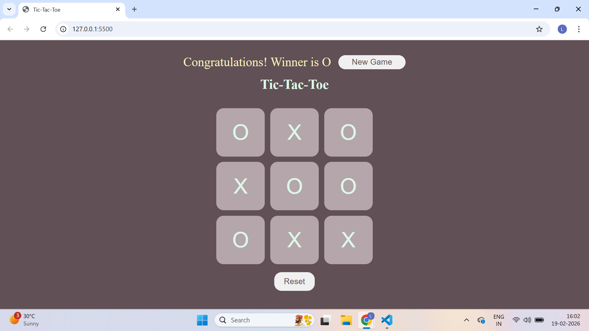

# 🎮 Tic-Tac-Toe Game (HTML, CSS, JavaScript)

A simple and interactive Tic-Tac-Toe game built using HTML, CSS, and JavaScript.

This project demonstrates DOM manipulation, event handling, and game logic implementation using vanilla JavaScript.

---

## 📸 Screenshot

---

## 🚀 Features

- Two-player mode (X and O)
- Winner detection
- Draw detection
- Reset button
- New Game button
- Disabled boxes after selection
- Dynamic winner/draw message display

---

## 🧠 Game Logic

- The game tracks turns using a boolean variable.
- Winning patterns are stored in a 2D array.
- After every move:
  - It checks if a player has won.
  - If 9 moves are completed and no winner is found, the game declares a draw.
- Boxes are disabled once clicked.
- On reset:
  - Board clears
  - Turn resets
  - Move counter resets
  - Message container hides

---

## 🛠️ Technologies Used

- HTML5
- CSS3
- JavaScript (ES6)
- DOM Manipulation
- Event Listeners
- Arrays and Loops

---

## 📁 Project Structure

Tic-Tac-Toe/
│
├── index.html
├── style.css
├── index.js
├── README.md
└── Tic-Tac-Toe.png

---

## 💡 Concepts Practiced

- querySelector & querySelectorAll
- addEventListener
- forEach loop
- Conditional logic
- Functions & arrow functions
- Game state management
- UI state handling (show/hide elements)

---

## 🚀 Live Demo
👉 https://tic-tac-toe-lekhashree.netlify.app

## 👩‍💻 Author

Lekhashree B M  
Aspiring Java Full Stack Developer
